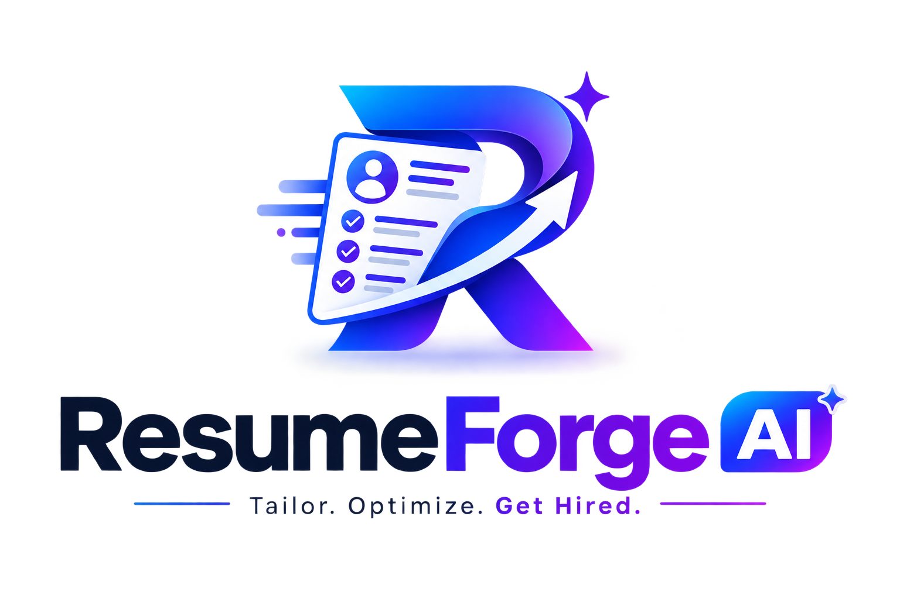

<div align="center">

  

  # ResumeAI — Next-Gen AI Career Copilot & Resume Platform

  <p align="center">
    <strong>An enterprise-grade, microservices-driven AI career copilot featuring intelligent resume scoring, dynamic career roadmapping, real-time AI mock interviews, and an atomic coin economy.</strong>
  </p>

  <p align="center">
    <a href="#-tech-stack"></a>
    <a href="#-tech-stack"></a>
    <a href="#-tech-stack"></a>
    <a href="#-tech-stack"></a>
    <a href="#-tech-stack"></a>
    <a href="#-license"></a>
  </p>

  <p align="center">
    <a href="#-key-features">Key Features</a> •
    <a href="#-tech-stack">Tech Stack</a> •
    <a href="#-system-architecture">Architecture</a> •
    <a href="#-getting-started">Getting Started</a> •
    <a href="#-coin-economy">Coin Economy</a> •
    <a href="#-deployment-guide">Deployment</a> •
    <a href="#-security--reliability">Security</a>
  </p>

</div>

---

## 🌟 Overview

**ResumeAI** is a full-stack, distributed AI career accelerator engineered for scalability and performance. Built upon a resilient microservices architecture, ResumeAI eliminates the guesswork in job hunting by providing:

1. **Precision Resume Scoring:** In-depth ATS alignment, role-fit metrics, and keyword gap analysis.
2. **AI Mock Interviews:** Role-adaptive technical & situational interview sessions powered by LangChain structured outputs with comprehensive post-interview feedback reports.
3. **Targeted Career Roadmaps:** Algorithmic skill gap mapping that converts resume deficiencies into sequential, milestone-driven learning paths.
4. **Interactive Resume Builder:** Live-rendered resume drafting with instant PDF compilation.
5. **Tokenized Coin Economy:** Atomic currency ledger powered by Razorpay payment webhooks with automatic refund fail-safes.
6. **Adaptive Dark / Light Theming:** Custom Tailwind CSS v4 styling with anti-FOUC state persistence.

---

## 🚀 Tech Stack

### 🖥️ Frontend Client
| Technology | Badge | Description |
| :--- | :--- | :--- |
| **React 19** |  | Modern UI library utilizing React 19 functional patterns |
| **Vite 8** |  | Next-generation frontend tooling and lightning-fast HMR |
| **TypeScript** |  | Strict end-to-end type safety |
| **Tailwind CSS v4** |  | Utility-first CSS engine with `@custom-variant dark` support |
| **Redux Toolkit** |  | Predictable global state management for coins, interviews, and session state |
| **PDF.js** |  | In-browser PDF extraction powered by dedicated Web Workers |
| **Lucide Icons** |  | Minimalist, pixel-perfect icon library |

### ⚙️ Backend & Microservices
| Technology | Badge | Description |
| :--- | :--- | :--- |
| **Node.js 22** |  | Asynchronous event-driven JavaScript runtime |
| **Express.js** |  | High-performance routing framework for API Gateway & microservices |
| **LangChain & LangGraph** |  | LLM graph orchestration, structured tool-calling, and evaluation chains |
| **Groq Cloud & OpenAI** |  | Ultra-low-latency LLM inference via `openai/gpt-oss-120b` and `llama-3.3` |
| **MongoDB Atlas** |  | Document-oriented primary datastore with Mongoose schemas |
| **Redis 7** |  | In-memory cache for session tokens, rate limiting, and blacklisting |
| **Firebase Admin SDK** |  | Secure JWT authentication with Google OAuth integration |
| **Razorpay** |  | Payment processing, coin purchasing, and cryptographic webhook verification |

### 🐳 DevOps & Deployment
| Technology | Badge | Description |
| :--- | :--- | :--- |
| **Docker & Compose** |  | Multi-container isolated local & staging environments |
| **Nginx** |  | High-concurrency static SPA server with custom MIME-type mapping |
| **Render** |  | Production unified container hosting with native health check probes |
| **Vercel** |  | Edge-optimized frontend hosting with instant global routing |

---

## 🏛️ System Architecture

All client interactions route through a resilient **API Gateway** on port `4000`. Internal microservices communicate over an isolated Docker network.

```
                                  ┌────────────────────────┐
                                  │      Client (SPA)      │
                                  │   (Vite / React 19)    │
                                  └───────────┬────────────┘
                                              │ HTTP / CORS
                                              ▼
                                 ┌──────────────────────────┐
                                 │       API Gateway        │
                                 │       (Port 4000)        │
                                 │  Rate Limiting & Proxy   │
                                 └────────────┬─────────────┘
                                              │
         ┌──────────────────┬─────────────────┼─────────────────┬──────────────────┐
         │                  │                 │                 │                  │
         ▼                  ▼                 ▼                 ▼                  ▼
┌─────────────────┐ ┌───────────────┐ ┌───────────────┐ ┌───────────────┐ ┌────────────────┐
│  auth-service   │ │ agent-service │ │interview-serv │ │roadmap-service│ │billing-service │
│   (Port 4001)   │ │  (Port 4002)  │ │  (Port 4003)  │ │  (Port 4004)  │ │  (Port 4005)   │
├─────────────────┤ ├───────────────┤ ├───────────────┤ ├───────────────┤ ├────────────────┤
│ • Firebase Auth │ │ • ATS Scoring │ │ • Question Gen│ │ • Gap Analysis│ │ • Coin Orders  │
│ • User Ledger   │ │ • Tailoring   │ │ • Realtime Eval│ │ • Milestones  │ │ • Webhooks     │
│ • Coins Ledger  │ │ • PDF Export  │ │ • Score Report│ │ • Path Plans  │ │ • Verification │
└────────┬────────┘ └───────┬───────┘ └───────┬───────┘ └───────┬───────┘ └───────┬────────┘
         │                  │                 │                 │                 │
         └─────────┬────────┴────────┬────────┴────────┬────────┴─────────────────┘
                   │                 │                 │
                   ▼                 ▼                 ▼
          ┌─────────────────┐ ┌─────────────┐ ┌───────────────────┐
          │     MongoDB     │ │    Redis    │ │  Groq / OpenAI    │
          │    (Storage)    │ │   (Cache)   │ │  (LLM Inference)  │
          └─────────────────┘ └─────────────┘ └───────────────────┘
```

---

## ✨ Key Features Breakdown

### 🎯 1. AI Resume Scoring & ATS Diagnostics
- **Document Ingestion:** Drag-and-drop parsing of `.pdf`, `.doc`, and `.docx` files via Web Workers without sending sensitive raw files to third parties.
- **Deep Algorithmic & LLM Analysis:** Evaluates resumes against specific Job Descriptions (JD) assessing keyword density, impact metrics, and clarity.
- **Visual Score Rings:** Interactive breakdown covering technical skills, soft skills, seniority alignment, and missing keywords.

### 🎙️ 2. Dynamic AI Mock Interviews
- **Customized Sessions:** Configure target role, seniority level, and custom job descriptions.
- **Roadmap Skill Gap Integration:** Directly imports identified weak points from the user's roadmap as targeted interview questions.
- **Function-Calling Schema:** Leverages LangChain structured outputs (`openai/gpt-oss-120b` or `llama-3.3`) for consistent schema parsing.
- **Comprehensive Post-Interview Evaluation:** Evaluates spoken/written answers out of 10, delivering constructive guidance and an overall assessment report.

### 🗺️ 3. Phased Career Roadmaps
- **Skill Deficiency Mapping:** Compares existing abilities against target roles to uncover critical technical gaps.
- **Structured Timeline Execution:** Generates sequential 4–5 phase learning tracks with concrete milestones, recommended resources, and difficulty curves.

### ✍️ 4. Interactive Resume Builder
- **Real-Time Reactive Previews:** Multi-section form editor (Experience, Skills, Education, Projects).
- **Direct PDF Export:** Server-side document rendering via `pdfkit` delivering downloadable, ATS-optimized PDFs.

### 🪙 5. Atomic Coin Economy & Razorpay Payments
- **Transparent Pricing Model:** 
  - Resume Scoring: **5 coins**
  - AI Mock Interview: **10 coins**
  - Career Roadmap: **8 coins**
- **Automatic Failure Refunds:** If an external LLM request fails, consumed coins are refunded immediately to the user's balance.
- **Idempotent Webhook Verification:** SHA-256 HMAC signature validation guards against duplicate credits.

### 🌓 6. Adaptive Dark / Light Theming
- Built with Tailwind CSS v4 custom variant: `@custom-variant dark (&:where(.dark, .dark *))`.
- Instant system preference detection (`prefers-color-scheme: dark`) with anti-FOUC inline header script.

---

## 📂 Repository Layout

```
Resume-AI-master/
├── client/                     # React 19 Frontend (Vite + Tailwind CSS v4)
│   ├── public/                 # Static assets (logo, pdf.worker.min.mjs)
│   ├── src/
│   │   ├── components/         # Modular UI & Layout components
│   │   ├── context/            # AuthContext & ThemeContext
│   │   ├── features/           # Redux Toolkit slices (auth, coins, interview)
│   │   ├── lib/                # PDF parser, API clients, Firebase init
│   │   └── pages/              # Application views & Admin portal
│   ├── nginx.conf              # Production Nginx reverse-proxy configuration
│   └── vercel.json             # Vercel SPA deployment rules
├── gateway/                    # Express API Gateway (Port 4000)
│   └── src/
│       ├── config/             # Gateway environment & service registries
│       ├── middleware/         # IPv6-safe rate limiters & request loggers
│       └── routes/             # Reverse-proxy routes to microservices
├── services/
│   ├── auth-service/           # User lifecycle, Firebase Admin, Coins ledger (Port 4001)
│   ├── agent-service/          # ATS evaluation, PDF generation (Port 4002)
│   ├── interview-service/      # AI interview session graph & grading (Port 4003)
│   ├── roadmap-service/        # Gap analysis & milestone roadmapping (Port 4004)
│   └── billing-service/        # Razorpay integration & webhook handlers (Port 4005)
├── Dockerfile.backend          # Unified container build for single-service cloud hosts
├── start-backend.js            # Multi-process orchestrator for backend services
├── render.yaml                 # Render Blueprint configuration
├── docker-compose.yml          # Local multi-container development stack
├── .env.example                # Root environment configuration template
└── README.md                   # Project documentation
```

---

## 🛠️ Getting Started

### Prerequisites
- [Node.js](https://nodejs.org/) v20+ or v22+
- [Docker Desktop](https://www.docker.com/) (recommended)
- Free [Groq API Key](https://console.groq.com/keys) or OpenAI API Key
- Free [Firebase Project](https://console.firebase.google.com/) for authentication

---

### Quickstart with Docker Compose (Recommended)

1. **Clone the repository:**
   ```bash
   git clone https://github.com/yourusername/Resume-AI.git
   cd Resume-AI
   ```

2. **Configure environment variables:**
   ```bash
   cp .env.example .env
   cp client/.env.example client/.env
   ```
   *Fill in your Firebase credentials, Groq API key (`gsk_...`), and Razorpay test keys.*

3. **Launch the entire stack:**
   ```bash
   docker compose up -d --build
   ```

4. **Access the application:**
   - **Frontend Application:** [http://localhost:5173](http://localhost:5173)
   - **API Gateway:** [http://localhost:4000](http://localhost:4000)
   - **Gateway Health Check:** [http://localhost:4000/health](http://localhost:4000/health)

---

### Manual Local Development (Without Docker)

1. **Start MongoDB and Redis:**
   ```bash
   docker compose up -d mongo redis
   ```

2. **Run backend microservices:**
   ```bash
   # Terminal 1 - Gateway
   cd gateway && npm install && npm run dev

   # Terminal 2 - Auth Service
   cd services/auth-service && npm install && npm run dev

   # Terminal 3 - Agent Service
   cd services/agent-service && npm install && npm run dev

   # Terminal 4 - Interview Service
   cd services/interview-service && npm install && npm run dev

   # Terminal 5 - Roadmap Service
   cd services/roadmap-service && npm install && npm run dev

   # Terminal 6 - Billing Service
   cd services/billing-service && npm install && npm run dev
   ```

3. **Run the Frontend Client:**
   ```bash
   # Terminal 7 - Client
   cd client && npm install && npm run dev
   ```

---

## 🚢 Deployment Guide

### Deploying 100% Free: GitHub + Render + Vercel

This repository includes a unified multi-process container setup ([Dockerfile.backend](Dockerfile.backend)) that allows all 5 microservices and the gateway to run inside **1 single free instance on Render**, staying within the 750 free hours/month limit.

#### 1. Backend on [Render.com](https://render.com)
1. Create a **New Web Service** pointing to your GitHub repository.
2. Set **Environment:** `Docker`
3. Set **Dockerfile Path:** `./Dockerfile.backend`
4. Set **Plan:** `Free`
5. Add your environment variables from `.env`:
   - `MONGODB_URI`
   - `FIREBASE_PROJECT_ID`, `FIREBASE_CLIENT_EMAIL`, `FIREBASE_PRIVATE_KEY`
   - `OPENAI_API_KEY` (Your Groq key `gsk_...`)
   - `OPENAI_BASE_URL` (`https://api.groq.com/openai/v1`)
   - `OPENAI_MODEL` (`openai/gpt-oss-120b`)
   - `RAZORPAY_KEY_ID`, `RAZORPAY_KEY_SECRET`
   - `CLIENT_ORIGIN` (`*` or your Vercel URL)
6. Deploy! Render will provide your public API URL (e.g., `https://resumeai-api.onrender.com`).

#### 2. Frontend on [Vercel](https://vercel.com)
1. Import your GitHub repository into Vercel.
2. Set **Root Directory:** `client`
3. Set **Framework Preset:** `Vite`
4. Configure Environment Variables:
   - `VITE_API_BASE_URL`: `https://resumeai-api.onrender.com/api/v1`
   - Paste all 6 `VITE_FIREBASE_*` variables from `client/.env`.
5. Deploy! Vercel will output your live URL (e.g., `https://resumeai.vercel.app`).

#### 3. Authorize Production Domain in Firebase
In **Firebase Console** $\rightarrow$ **Authentication** $\rightarrow$ **Settings** $\rightarrow$ **Authorized domains**, add your Vercel URL (`resumeai.vercel.app`).

---

## 🔒 Security & Reliability

- **Cryptographic Signatures:** Razorpay payments verify Webhook and redirect payloads using HMAC SHA-256 signatures before coin balances are modified.
- **IPv6-Safe Rate Limiting:** All gateway routes utilize `ipKeyGenerator` to prevent subnet spoofing and denial-of-service attempts.
- **Stateless Session Tokens:** Session integrity is verified through Firebase ID token exchange backed by Redis token blacklisting.
- **Fail-Safe Coin Operations:** Dedicated atomic balance reservations automatically refund coins to the user in the event of an upstream LLM timeout.

---

## 📄 License

Distributed under the **MIT License**. See `LICENSE` for more details.

---

<div align="center">
  <p>Built with ❤️ by passionate engineers.</p>
  <p>
    <a href="#resumeai--next-gen-ai-career-copilot--resume-platform">Back to Top ↑</a>
  </p>
</div>
